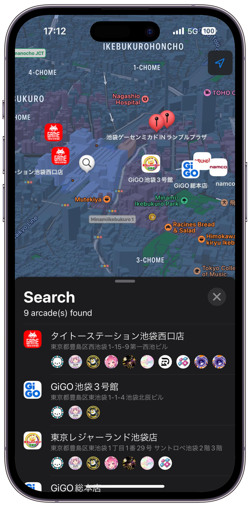
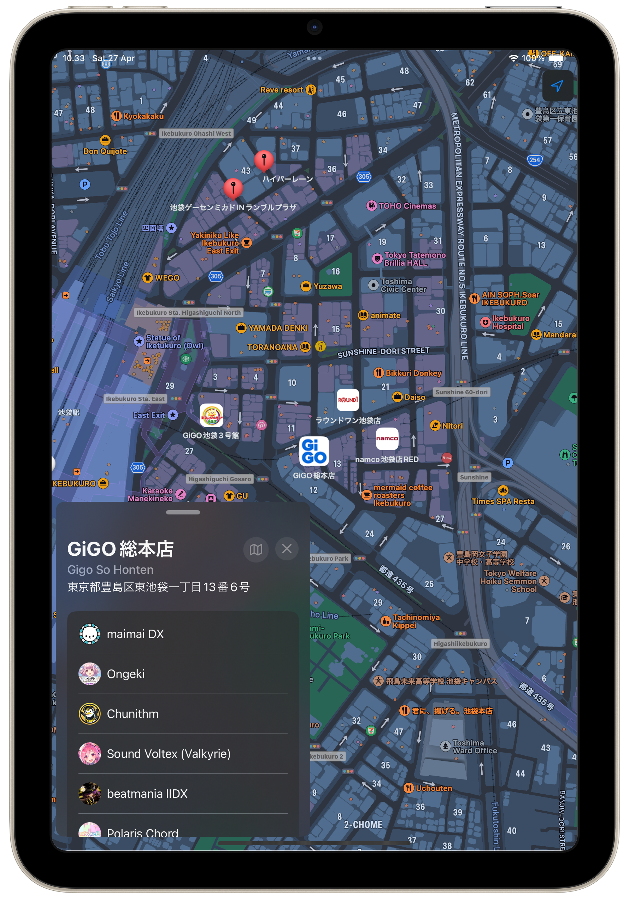

# Otoge Finder - Music Game Locator for iOS
Find arcades (game center) that has your favorite music game (otoge).

<p align="center">
  
  
</p>

## Development

### Core Tech Stacks

- [SwiftUI](https://developer.apple.com/xcode/swiftui/), Apple's declarative UI library
  - Note that this app requires **iOS 17** as it uses the updated MapKit Framework from SwiftUI 5
- [The Composable Architecture](https://github.com/pointfreeco/swift-composable-architecture)
- [SwiftPM](https://www.swift.org/documentation/package-manager/) for package management

### Building

This project uses XcodeGen to generate the Xcode Project using the project spec specified in `project.yml`.

1. Follow the instruction at [XcodeGen](https://github.com/yonaskolb/XcodeGen?tab=readme-ov-file#installing) to install XcodeGen.
    - For example, with Homebrew: `brew install xcodegen`
2. In terminal, navigate to the root directory of this repo.
3. Run `xcodegen` in the terminal. `Otoge.xcodeproj` will be generated.
4. Open the generated project on Xcode and run the application

### Arcade List Repository

Otoge Finder stores list of games for ALL.Net and e-amusement locally, powered by [djzmo's otoge.app](https://github.com/djzmo/otoge-app/tree/main/packages/scripts/src) fetch script. However, this project also contains an option to directly communicate with [Otoge.app](https://otoge.app/) server by replacing the dependency value in `Dependencies.swift`.

> [!WARNING]  
> Note that I do not guarantee Otoge.app cross-compatibility will be supported forever.

Replace this:

```swift
private enum AppArcadeRepository: DependencyKey {
    static let liveValue: ArcadeRepositoryProtocol = LocalArcadeRepository()
}
```

with this:

```swift
private enum AppArcadeRepository: DependencyKey {
    static let liveValue: ArcadeRepositoryProtocol = OtogeAppArcadeRepository()
}
```

## Credits
This project is heavily inspired, and partly based on [djzmo's Otoge.app](https://github.com/djzmo/otoge-app) web app. The local arcade list files are generated using Otoge.app's fetch script.